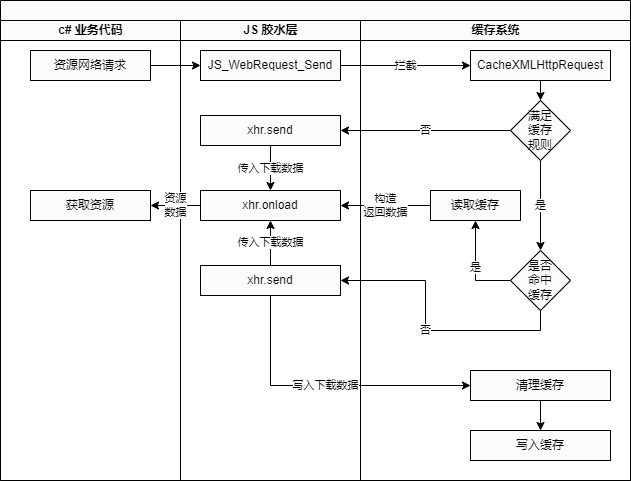
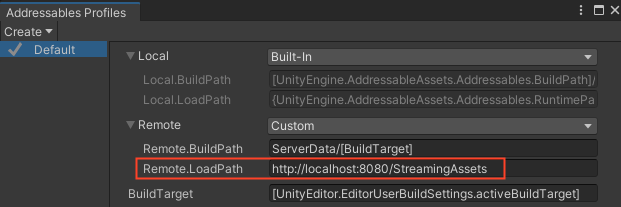
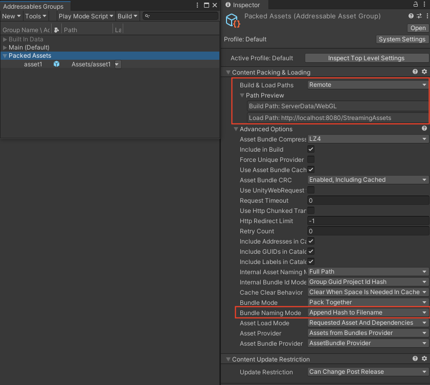

# 资源缓存

## 版本要求

OPPO 小游戏打包工具：2.1.8-beta.0 及以上
> <span style="font-size:0.7em">建议前往`tools` 目录安装 `unity_webgl_rpk_oppo_v8.0.0.unitypackage` 及以上版本，通过 [SDK 自检更新](SDKUpdate.md) 能力进行升级。也可通过命令行 `npm install -g @oppo-minigame/cli@^2.1.8-beta.0` 进行安装</span>

## 系统介绍

资源缓存系统当前主要针对 AssetBundle 资源，框架会根据缓存规则，自动对满足条件的资源进行缓存、加载、下载。
开发者可使用以下 Unity API 进行网络请求，而无需关心资源来自于网络或缓存，以及是否需要进行缓存。

- UnityWebRequest
- UnityWebRequestAssetBundle
- Addressables
- WWW

## 运作原理



## 缓存规则

### 配置项

缓存系统支持用户进行多字段配置，来满足个性化需求，最终写入小游戏工程根目录的 `manifest.json` 文件中。我们建议您通过 [SDK 打包工具](TransformBySDK.md#使用指引) 进行配置，您也可以通过命令行 `quickgame unity --*` 进行配置或直接修改目标文件。具体字段解释如下

- <span style="font-size:0.7em">**disableBundleCache**  
是否禁用缓存，建议默认开启</span>
- <span style="font-size:0.7em">**bundlePathIdentifier**  
缓存路径标识，使用分号分隔，例如 StreamingAssets;bundles  
只有以配置项结尾的 URL 路径才会进行缓存判断，例如配置为 StreamingAssets，请求 URL 为 https://localhost:8080/StreamingAssets/8d265a9dfd6cb7669cdb8b726f0afb1e.bundle； 若不填写则所有路径都会进行缓存判断；其他情况传入的 URL 均视为常规网络请求</span>
- <span style="font-size:0.7em">**excludeFileExtensions**  
不缓存的文件类型，使用分号分隔，例如 .json;.hash  
建议将确定不缓存的资源文件类型写入配置，提高缓存系统的性能</span>
- <span style="font-size:0.7em">**bundleHashLength**  
资源 hash 占多少长度，默认 32 位  
缓存系统通过哈希值来判定更新，出于性能考虑不会对内容做额外计算来验证，因此 hash 在资源命名中起到至关重要的作用。通过 Unity `BuildAssetBundleOptions.AppendHashToAssetBundleName` 或在 `Addressables` 面板中进行配置，会生成默认为 32 位的 hash 拼接在资源名末尾</span>
- <span style="font-size:0.7em">**defaultReleaseSize**  
清理缓存时默认额外清理的大小，单位 MB，默认 30MB  
Unity 小游戏默认有 500MB 的用户存储空间，若缓存写入时超过此值，则缓存系统会按照 LRU 规则清理出当前配置的空间大小，防止后续写入时频繁进行清理
</span>
- <span style="font-size:0.7em">**keepOldVersion**  
资源更新后是否保留旧版本资源，默认删除不保留  
若保留旧版本资源，则未来需要回滚资源时，能够命中缓存，不触发网络下载
</span>
- <span style="font-size:0.7em">**excludeClearFiles**  
自动清理时忽略的文件，支持纯 hash 或名称，使用分号分隔，例如 8d265a9dfd6cb7669cdb8b726f0afb1e;asset1  
缓存系统进行 LRU 清理时，在配置范围内所有已缓存的资源文件版本都会被保留
</span>
- <span style="font-size:0.7em">**enableCacheLog**  
是否将缓存信息输出到控制台，便于调试  
自测时建议开启，缓存系统的关键操作及耗时会输出到控制台，方便进行调试和耗时统计
</span>

### 命名规则

符合命名规则的资源，才会被缓存系统识别，否则被视为常规 Unity 网络请求。可缓存资源的命名必须为以下形式之一

- 纯 hash：例如 8d265a9dfd6cb7669cdb8b726f0afb1e
- 名称_hash：例如 font_8d265a9dfd6cb7669cdb8b726f0afb1e
- 名称-hash：例如 font-8d265a9dfd6cb7669cdb8b726f0afb1e

> <span style="font-size:0.7em">注意：名称没有过多要求，满足 Unity 约束即可。在满足前面几种命名规则的前提下，可以额外加后缀，例如 8d265a9dfd6cb7669cdb8b726f0afb1e.bundle，font_8d265a9dfd6cb7669cdb8b726f0afb1e.ttf</span>

## 使用示例

> <span style="font-size:0.7em">界面截图以 `Unity 2021.3.14f1` 版本为例 </span>

1. 假设使用环境如下
    - manifest.json
    ```javascript
    {
        "disableBundleCache": false,
        "bundlePathIdentifier": "StreamingAssets",
        "excludeFileExtensions": ".json;.hash",
        "bundleHashLength": 32,
        "defaultReleaseSize": 30,
        "keepOldVersion": false,
        "excludeClearFiles": [],
        "enableCacheLog": true
    }
    ```

    - 资源服务器 URL：`https://localhost:8080/StreamingAssets`
    - 请求资源名称：`asset1-8d265a9dfd6cb7669cdb8b726f0afb1e`
    - 缓存中已存在资源：`asset1-71b23877fab04af9051cf6c7630d659f`
    

2. 在 Unity 中通过多种方式请求服务端 AssetBundle
    - UnityWebRequest
        ```
        private IEnumerator LoadAssetBundle()
        {
            var uwr = UnityWebRequest.Get("https://localhost:8080/StreamingAssets/asset1-8d265a9dfd6cb7669cdb8b726f0afb1e");
            yield return uwr.SendWebRequest();
            var bytes = (uwr.downloadHandler as DownloadHandlerBuffer).data;
            var assetBundle = AssetBundle.LoadFromMemory(bytes);
            // 后续业务逻辑...
        }
        ```

    - UnityWebRequestAssetBundle

        ```
        private IEnumerator LoadAssetBundle()
        {
            var uwr = UnityWebRequestAssetBundle.Get("https://localhost:8080/StreamingAssets/asset1-8d265a9dfd6cb7669cdb8b726f0afb1e");
            yield return uwr.SendWebRequest();
            var assetBundle = (uwr.downloadHandler as DownloadHandlerAssetBundle).assetBundle;
            // 后续业务逻辑...
        }
        ```
        
    - Addressables

        
        

        ```
        private async void LoadAddressableAsset()
        {
            var handle = Addressables.LoadAssetAsync<GameObject>("asset1");
            await handle.Task;
            var prefab = handle.Result;
            // 后续业务逻辑...
        }
        ```
        > <span style="font-size:0.7em">假设打包出来的 AssetBundle 刚好和上面的名称 `asset1-8d265a9dfd6cb7669cdb8b726f0afb1e` 一致，Addressables 系统会根据生成的 `catalog.json` 文件，将代码中传入的 `asset1` 映射为完整的资源名称。更多关于 `Addressables` 系统的使用说明，请参考 [Unity 官方文档](https://docs.unity3d.com/Manual/com.unity.addressables.html)</span>

3. 由于资源服务器 URL 末端 `StreamingAssets` 在 `bundlePathIdentifier` 配置项中，此次请求被缓存系统处理

4. 资源名称解析后被分解为 `name=asset1`，`hash=8d265a9dfd6cb7669cdb8b726f0afb1e`

5. 检查同名 `name=asset1` 已有旧缓存，根据配置 `keepOldVersion=false` 删除旧缓存文件 `asset1-71b23877fab04af9051cf6c7630d659f`

6. 下载新资源 `asset1-8d265a9dfd6cb7669cdb8b726f0afb1e`，下载完成后写入缓存，并将数据返回给业务代码
    - 执行 `yield return` 之后的代码
    - 执行 `await` 之后的代码