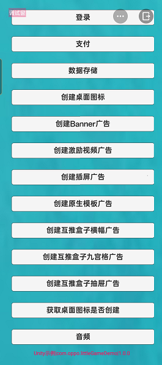
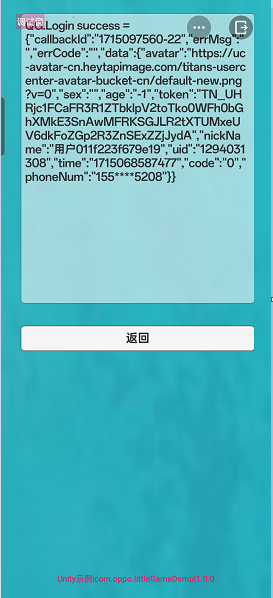
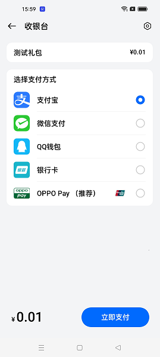
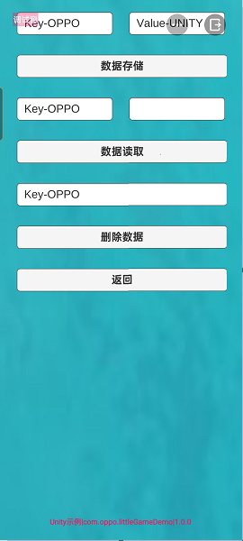
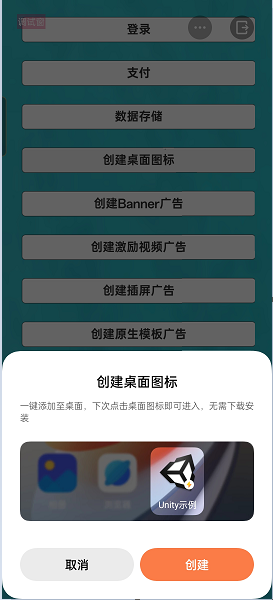
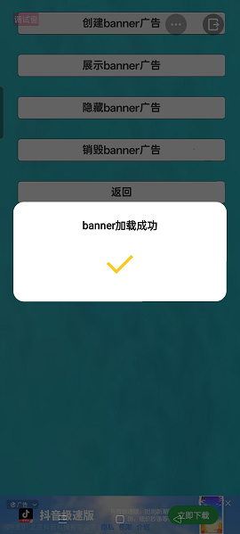
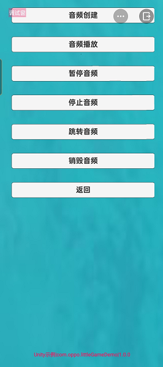

# 示例工程

## 1.主界面

## 2.登录
点击 `登录` 后将以当前 OPPO 账号进行登录请求，打印登录结果，参考 API [QG.Login](API.md#登录)

## 3.支付
> 非测试页面，此操作将进行真实的支付

点击 `支付` 将调起 OPPO 支付 SDK，参考 API [QG.Pay](API.md#支付)

## 4.数据储存
通过 key-value 的形式支持本地存储，参考 API [QG.Storage](API.md#数据储存)

## 5.创建桌面图标
弹出创建桌面图标确认界面，提醒用户进行二次确认，参考 API [QG.HasShortcutInstalled](API.md#创建桌面图标)

## 6.广告
> 测试 RPK 包名必须为 `com.oppo.littleGameDemo` 才能显示广告

支持多种类型的广告，以激励视频广告为例，参考 API [QG.CreateRewardedVideoAd](API.md#激励视频广告)

## 7.音频
支持音频的多种基本操作，以播放音频为例，参考 API [QG.PlayAudio](API.md#音频播放)

