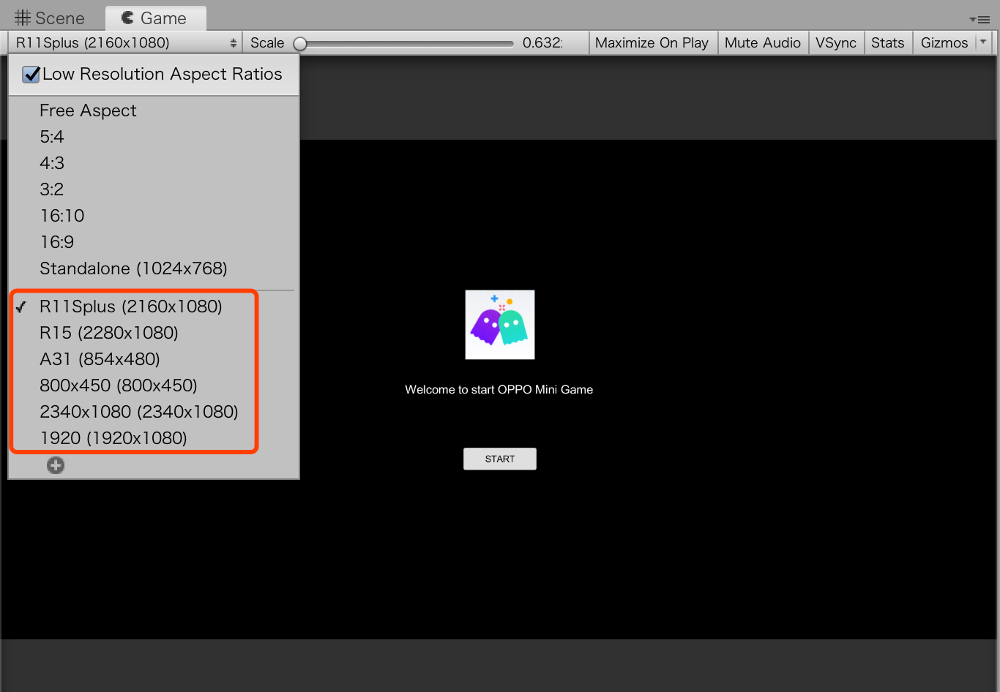

# 技术常见问题 QA

## Unity WebGL

### 1. 怎么通过 JavaScript 回调给 C# 脚本

- 可以通过 `window.unityInstance.SendMessage(objectName,
methodName, value)` 进行调用，其中 OPPO 会将初始化的 Unity 实例赋值到 `window['unityInstance']` 中，具体参考以下文档

    - Unity：https://docs.unity3d.com/Manual/webgl-interactingwithbrowserscripting.html
    - OPPO 小游戏 API 文档：https://ie-activity-cn.heytapimage.com/static/minigame/CN/docs/index.html#/


### 2. 打包 AssetBundle 发布到 WebGL 无法使用

- 需要使用 LZ4 压缩 AssetBundle，打包命令 `BuildPipeline.BuildAssetBundles(path, BuildAssetBundleOptions.ChunkBasedCompression, BuildTarget.WebGL)`

### 3. 是否支持 WebGL2.0

- 暂不支持，详见 [能力支持](CapabilitySupport.md)

## 打包配置

### 1. 游戏如何修改桌面图标、横竖屏、最小平台版本

- 优先推荐您 [使用 SDK 进行配置](TransformBySDK.md)

- 您也可以直接修改 `quickgame/manifest.json` 文件，并且重新用 `quickgame unity [release]` 即可重新发布

## 发布上架

### 1. 是否可以上架未带 `xxx.signed.rpk` 的 RPK 包到线上

- 需要使用 `quickgame unity release` 打包生成 RPK，才可以上架到线上。其
中开发者需要保留签名，用于以后代码更新重新打包

### 2. 游戏上架包体太大怎么解决

- 由于 OPPO 小游戏平台对 RPK 包体有限制大小，最大不能超过 30M。而 Unity 发布的游戏大部分都比较大，将游戏的资源放到开发者自己的服务器上，并修改 Unity 配置文件，再重新打包。以 2019 版本为例如下所示

    ```javascript
    {
        "companyName": "company",
        "productName": "demo",
        "productVersion": "0.1",
        "dataUrl": "https://xxx.com/webgl.data.unityweb",
        "wasmCodeUrl": "https://xxx.com/webgl.wasm.code.unityweb",
        "wasmFrameworkUrl": "webgl.wasm.framework.unityweb",
        "graphicsAPI": ["WebGL 1.0"],
        "webglContextAttributes": {"preserveDrawingBuffer": false},
        "splashScreenStyle": "Dark",
        "backgroundColor": "#231F20",
        "developmentBuild": false,
        "multithreading": false,
        "unityVersion": "2019.1.0f2"
    }
    ```

- 原Unity项目中 AssetBundle 文件保存 WebGL 项目的 StreamingAssets 文件夹下，把 StreamingAssets 文件夹中的所有内容放到自己服务器上。打包 RPK 包时，在 WebGL 发布的目标目录执行命令时，添加参数 --addressable，参数 value 为您的服务器地址。执行示例命令

    `quickgame unity --unityVer 2019.4.35f1 --addressable https://oppo/AddressableAssetsData`
- 打包后的 RPK 包体缩小不少，成功把分包中的资源放到远程服务器上请求了
- 经过上述处理后，打包的 RPK 包体仍然超出规定的 30MB，后续还可以考虑压缩、优化、重构源代码

## 环境适配

### 1. 屏幕上下左右留有黑边

- 开发者需要针对不同的手机进行屏幕适配。由于 OPPO 小游戏的画布宽和高跟屏幕分
辩率保持一致，并且 devicePixelRatio 为 1 ，所以进行适配，首先需要适配不同的手机
分辨率，如下所示

    

- 最后需要适配发布的分辨率，并在手机进行测试，如下所示

    

### 2. 如何接入平台能力，包括退出、账户、支付、广告等

- 优先推荐您使用 Unity SDK，下载地址位于 `tools/unity_webgl_rpk_oppo_v*.unitypackage`。接着参考 [API 使用文档](API.md)，使用 C# 封装的接口调用平台能力

- 还可以通过调用 window 能力一样调用我们平台能力，具体参考以下文档

    - Unity：https://docs.unity3d.com/Manual/webgl-interactingwithbrowserscripting.html 
    - OPPO 小游戏 API 文档：https://ie-activity-cn.heytapimage.com/static/minigame/CN/docs/index.html#/

### 3. 默认文字不显示怎么办

- 默认中文字体不显示，必须使用外部导入的字体（需要下载字体文件）

### 4. 音频使用什么格式

- 建议使用 `.mp3`

### 5. 是否可以使用Blob格式数据

- 当前不支持，推荐使用 `ArrayBuffer` 替代

### 6. 安装 Node.js 时提示 Warning: Setting the NODE_TLS_REJECT_UNAUTHORIZED environment variable to ‘0‘ makes TLS connections

- 环境变量里面查看，如果配置了 `NODE_TLS_REJECT_UNAUTHORIZED`，将其删除就可以了

### 7. 使用 Demo 示例中的支付代码可能会碰到的问题

- 查看 OPPO 小游戏文档中支付相关说明

    https://ie-activity-cn.heytapimage.com/static/minigame/CN/docs/index.html#/develop/pay/pay-introduction

    若仍无法解决，请 [联系我们](IssueAndContact.md)

### 8. 是否支持分包

- 部分支持，详见 [能力支持](CapabilitySupport.md) `能力-分包` 项