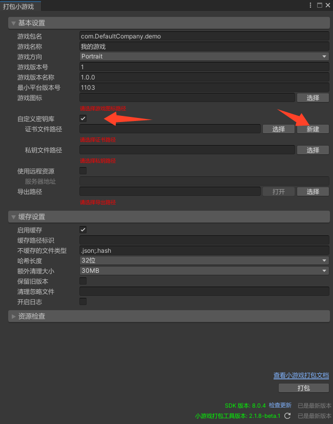
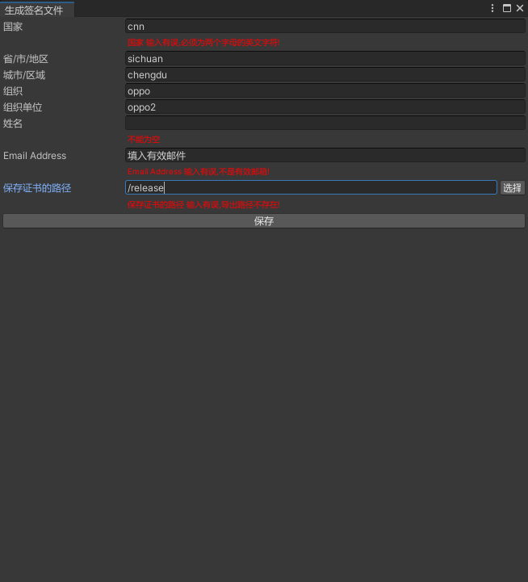
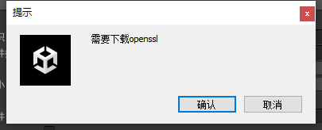
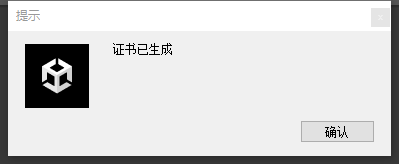
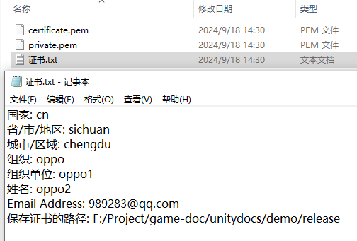
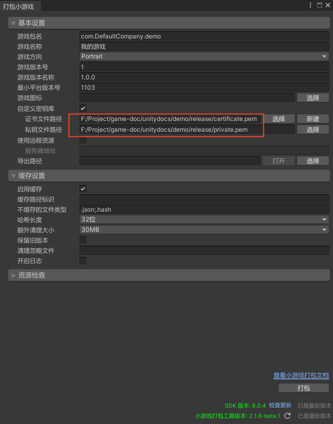

# 一键生成签名证书

## 版本要求

SDK：V8.0.5 及以上
> 可前往`tools` 目录安装 `unity_webgl_rpk_oppo_v8.0.5.unitypackage` 及以上版本，后续版本可通过 [SDK 自检更新](SDKUpdate.md) 能力进行升级

## 功能说明

> 界面截图以 `Unity 2021.3.14f1` 版本为例

#### 新建签名证书

1. 执行 `OPPO小游戏 -> 打包小游戏 -> 勾选 自定义密钥库 -> 新建`
   
2. 按提示输入有效参数,点击保存
   
3. 确认需要下载的证书工具 `会优先使用全局openssl工具,如果没有点击确认自动安装`
   
4. 生成证书提示,并弹出证书保存路径

   
   
5. 创建成功证书和私钥路径会自动导入
   
