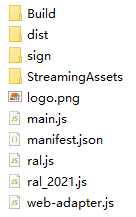
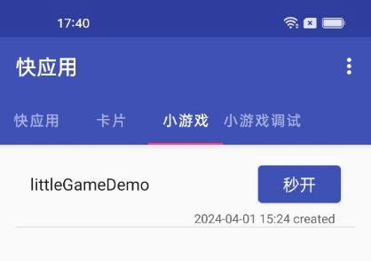

# 运行小游戏

## 工程结构

导出后的标准小游戏工程结构如下

- **Build**：Unity WebGL 导出目录
- **dist**：存放打包好的小游戏 rpk
- **sign**：存放签名文件
- **StreamingAssets**：对应 Unity 中的同名目录，若非必需，可删除此目录，减少包体大小
- **logo.png**：游戏图标
- **main.js**：游戏入口文件
- **manifest.json**：通过 [Unity SDK](TransformBySDK.md) 或 [命令行](TransformByCLI.md) 导出小游戏时生成的游戏配置文件
- **ral.js、ral_2021.js、web-adapter.js**：小游戏适配文件

> 原则上不建议对导出工程进行修改，若确实需要修改，则在修改后执行 quickgame pack 重新打包

## 真机调试

OPPO 小游戏支持多种方式进行调试，可根据自身需求进行选择

### OPPO 小游戏开发者工具「强烈推荐」

通过统一的工具链对小游戏进行编译、打包、安装、真机调试等，建议使用最新版本，具体使用指南参考 [官方文档](https://ie-activity-cn.heytapimage.com/static/minigame/CN/docs/index.html#/develop/games/ide)

### 云真机调试「一般推荐」

具体使用指南参考 [官方文档](https://ie-activity-cn.heytapimage.com/static/minigame/CN/docs/index.html#/develop/feature/cloudmachine)

### 本地真机调试「一般推荐」

本地调试需要自行搭建调试环境，具体步骤如下

#### 安装调试器

在进行真机调试前需要安装小游戏调试器，推荐使用最新版本，[点此](https://ie-activity-cn.heytapimage.com/static/minigame/CN/docs/index.html#/develop/games/use) 前往安装。安装成功后，手机桌面会出现如下快应用图标

#### 安装小游戏

打好的小游戏 RPK 包存放在 `dist` 目录中，假设名为 `com.oppo.littleGameDemo`，可以通过以下 2 种方式安装

- 通过 ADB 安装 **「推荐」**：确保已安装 Android Debug Bridge 且手机已通过 USB 连接至电脑，在 `dist` 目录中打开控制台执行 `adb push com.oppo.littleGameDemo /sdcard/games/com.oppo.littleGameDemo`，命令执行结束后即安装成功

- 手动安装 「不推荐」： 确保手机以通过 USB **文件传输**方式连接至电脑，通过文件浏览器打开 /sdcard/games 目录（若没有此目录需要先创建），将 `com.oppo.littleGameDemo` 拷贝至目录下即可完成安装

若安装成功，打开之前安装的调试器 App 即可看到小游戏，若安装前已打开调试器则下拉刷新列表

#### 调试小游戏

调试工作将在 Chrome 浏览器环境下进行，具体使用指南参考 [官方文档](https://ie-activity-cn.heytapimage.com/static/minigame/CN/docs/index.html#/develop/games/debug)