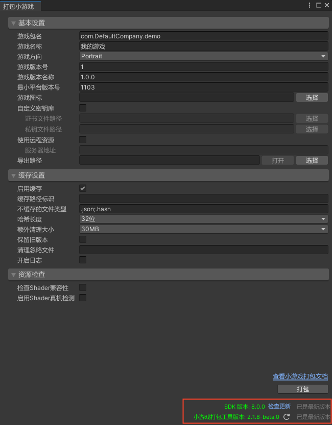

# SDK 自检更新

## 版本要求

SDK：V8.0.0 及以上
> 可前往`tools` 目录安装 `unity_webgl_rpk_oppo_v8.0.0.unitypackage` 及以上版本，后续版本可通过 [SDK 自检更新](SDKUpdate.md) 能力进行升级

## 功能说明

> 界面截图以 `Unity 2021.3.14f1` 版本为例

Unity SDK 自 V8.0.0 版本开始具备自检更新能力，展示及交互区域位于界面底部，如下图所示

由于 SDK 部分模块依赖 `OPPO 小游戏打包工具`（以下简称 `打包工具`），因此每次打开主界面时，会对 SDK 本身和打包工具进行版本检查。在打包工具不满足指定版本时，部分模块及打包功能将不可用，`打包` 按钮置灰无法点击，需要升级后方可使用。第一次打开界面进行版本检查会相对较慢，并且与您的网络环境和速度相关，请您耐心等待，若长时间停留在版本检查阶段，请 [联系我们](IssueAndContact.md)
> 若出现未检测到打包工具最新版本的情况，请尝试将源切换为 npm（推荐使用 [nrm](https://www.npmjs.com/package/nrm)），其他 npm 源中的版本可能会滞后

### SDK 更新

SDK 版本展示区域分为 `[当前版本] [检查更新] [版本状态]`，点击 `检查更新` 可手动获取最新版本状态

- 当正在检查 SDK 版本时，界面将展示为 `[SDK 版本: x.x.x] [正在检测 SDK 版本更新...]`
- 当 SDK 已是最新版本时，界面将展示为 `[SDK 版本: x.x.x] [检查更新] [已是最新版本]`
- 当 SDK 有新版本时，界面将展示为 `[SDK 版本: x.x.x] [检查更新] [升级版本]`。点击 `升级版本` 后将在安装包下载完成后，自动进行安装
- 当 SDK 检查版本异常时，界面将展示为 `[SDK 版本: x.x.x] [检查更新] [更新获取失败]`。若出现此情况，您可以点击 `检查更新` 重试，根据 Unity 控制台错误输出排查问题。若仍然无法解决，请 [联系我们](IssueAndContact.md)

### 打包工具更新

打包工具版本展示区域分为 `[当前版本] [刷新版本] [版本状态]`，点击 `刷新图标` 可手动刷新版本状态

- 当正在刷新打包工具版本时，界面将展示为 `[正在检查打包工具版本...]`
- 当打包工具已是最新版本时，界面将展示为 `[小游戏打包工具版本: x.x.x] [刷新版本] [已是最新版本]`
- 当打包工具有新版本时，界面将展示为 `[小游戏打包工具版本: x.x.x] [刷新版本] [升级版本]`，点击 `升级版本` 会将打包工具升级到最新版本
- 若您未安装过打包工具，或打包工具刷新版本异常时，界面将展示为 `[获取打包工具版本失败，请安装后重试] [刷新版本] [升级版本]`。若出现此情况，您可以点击 `升级版本` 来安装最新的打包工具。若升级失败，可根据 Unity 控制台错误输出排查问题。若仍然无法解决，请 [联系我们](IssueAndContact.md)