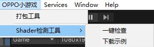
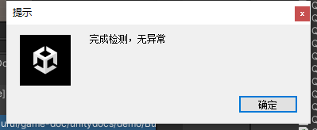
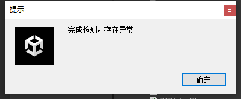
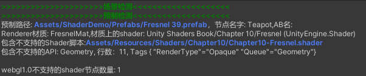
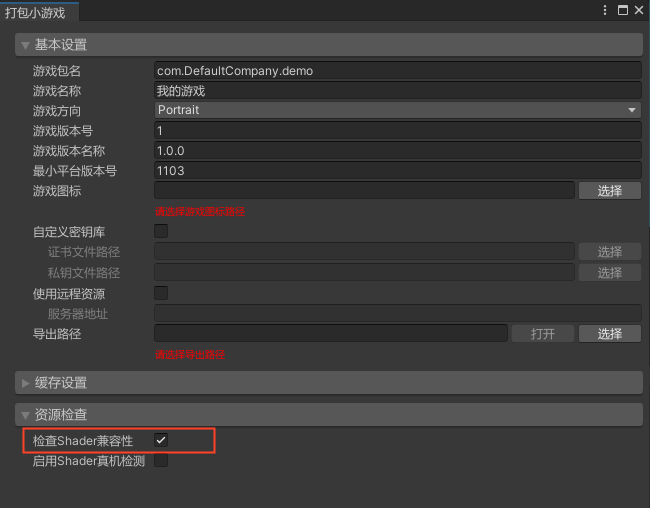
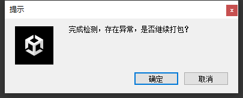
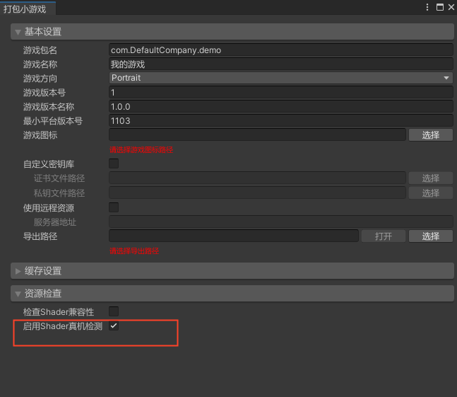
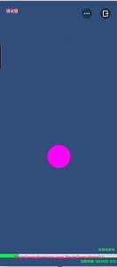
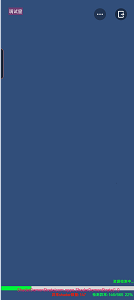
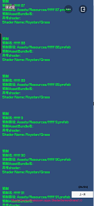

# Shader 兼容性检测

## 版本要求

SDK：V8.0.0 及以上
> 可前往`tools` 目录安装 `unity_webgl_rpk_oppo_v8.0.0.unitypackage` 及以上版本，后续版本可通过 [SDK 自检更新](SDKUpdate.md) 能力进行升级

## 功能说明

> 界面截图以 `Unity 2021.3.14f1` 版本为例

### 静态检测

静态检测用于编辑器模式下筛选常用不支持 WebGL1.0 的 Shader API

#### 一键检查

1. 执行 `OPPO小游戏 -> Shader检测工具 -> 一键检查`

   
2. 完成检测后提示`无异常`或`存在异常`

   
   

3. 查看 UnityConsole 打印 Shader 异常信息

   

4. 查看日志记录异常信息，日志记录在 Project 同级目录 ShaderLog 文件夹下
   - 历史日志: ShaderLog/HistoryLog/日期-时间-ShaderLog.txt
   - 最新日志: ShaderLog/日期-时间-ShaderLog.txt

#### 打包检查

1. 执行 `OPPO小游戏 -> 打包工具 -> 检查Shader兼容性 -> 打包`

   

2. 完成检测后提示`无异常`或`存在异常`，根据实际情况决定是否继续打包

   
   

### 真机检测

真机检测用于在真实运行环境中收集 Shader 兼容错误信息

1. 执行 `OPPO小游戏 -> 打包工具 -> 启用Shader真机检测 -> 打包`

   

2. 真机运行 RPK `开始测试 -> 加载资源 -> 检测异常 -> 完成检测`

       

3. 检测异常：输出资源信息，无异常：点击 `完成测试 -> 进入下个场景`