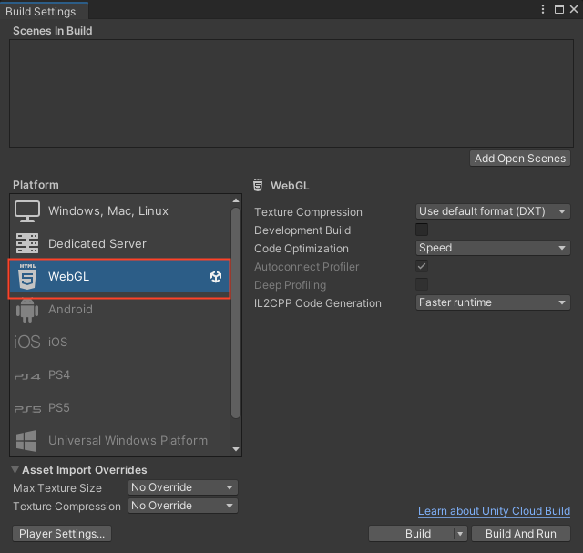
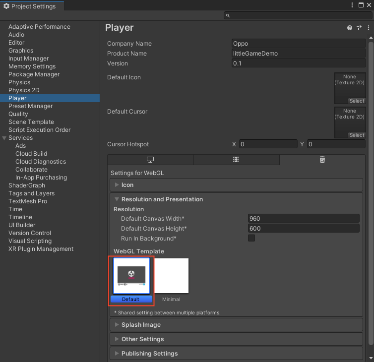
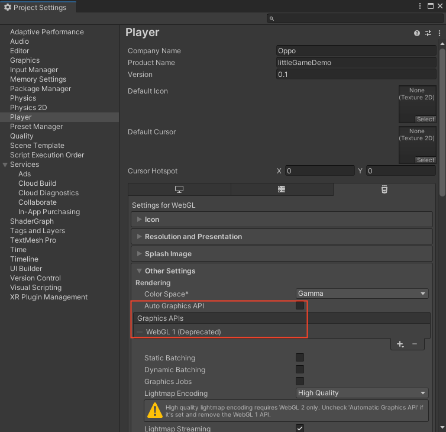
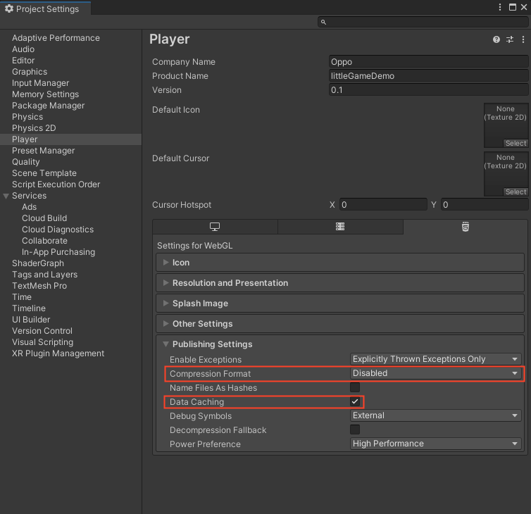
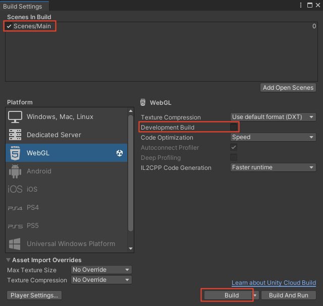
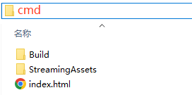

# 使用命令行导出小游戏

## 构建 Unity WebGL

### 项目设置

1. 打开 `File -> Build Settings...`，将目标平台切换为 `WebGL`

2. 打开 `Edit -> Project Settings...`

3. 在 `Player` 页签中展开 `Resolution and Presentation`，将 `WebGL Template` 设置为 `Default`

4. 在 `Player` 页签中展开 `Other Settings`，取消勾选 `Auto Graphics API`，仅保留 `WebGL 1` 选项
    > OPPO 小游戏当前只支持 WebGL1.0，WebGL2.0支持正在开发中

    

5. 在 `Player` 页签中展开 `Publishing Settings`，将 `Compression Format` 设置为 `Disabled`，并勾选 `Data Caching`
    > 后续打包 OPPO 小游戏时将会统一进行 GZip 压缩，因此在这里忽略压缩

    

6. 打开 `File -> Build Settings...`，添加需要打包的场景到 `Scenes In Build` 面板中，取消勾选 `Development Build`，点击 `Build` 进行构建
    > OPPO 小游戏当前不支持调试模式，正在开发中

    

7. 等待构建完成后进行 OPPO 小游戏打包流程

## 打包 OPPO 小游戏

1. 在 Unity WebGL 构建目录中打开控制台窗口，执行 `quickgame unity --unityVer <unityVer>` 进行打包
    > unityVer(不含尖括号)为必填项，表示当前 Unity 引擎版本号，例如 2021.3.14f1

    其他打包参数可以通过 `quickgame unity --help` 命令进行查询

    

2. 若打包成功，将在当前目录的上级目录中生成名为 `quickgame` 的文件夹。至此打包工作已完成，下一步将前往 [运行小游戏](RunQuickGame.md)