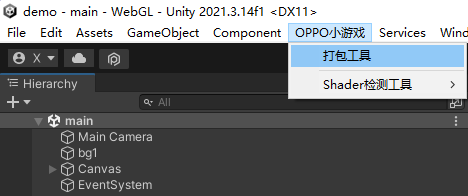
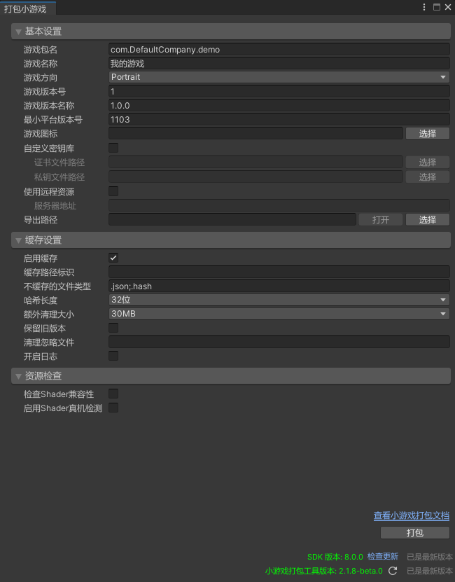
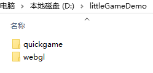

# 使用 SDK 导出小游戏

## 下载安装

1. 下载 `tools/unity_webgl_rpk_oppo_v*.unitypackage`，推荐使用最新版本

2. 在 Unity Editor 中导入下载的 SDK 包即可完成安装

## 使用指引

> 以下步骤均基于 Unity SDK V8.0.0 版本进行描述，建议您前往 `tools` 目录安装 `unity_webgl_rpk_oppo_v8.0.0.unitypackage` 及以上版本，界面截图以 `Unity 2021.3.14f1` 版本为例 

1. 点击 `OPPO小游戏 -> 打包工具` 打开主窗口

    

2. 根据项目实际情况填写信息，以下为填写示例

    
- **基本设置**
    - **游戏包名**：游戏唯一标识，打包后的文件以此命名，一般格式为 `com.company.product`，默认写为 `com.[PlayerSettings.companyName].[PlayerSettings.productName]`
    - **游戏名称**：游戏对外展示名称
    - **游戏方向**：进入游戏时的设备方向，包含 Portrait（竖屏）、Landscape（横屏）
    - **游戏版本号**：正整数，一般从 1 开始递增
    - **游戏版本名称**：与版本号对应，用于展示版本信息
    - **最小平台版本号**：一般填写 1103，平台版本支持的 API 可查询 [OPPO小游戏官方文档](https://ie-activity-cn.heytapimage.com/static/minigame/CN/docs/index.html#/)
    - **游戏图标**：游戏在平台、桌面展示的图标，正方形，默认 108x108 尺寸
    - **自定义秘钥库**：不勾选仅供调试使用，无法正式发布；勾选后将对包体进行正式签名，可以通过 [OPPO小游戏开发者工具](https://ie-activity-cn.heytapimage.com/static/minigame/CN/docs/index.html#/develop/games/ide?id=_5%e3%80%81%e7%94%9f%e6%88%90%e6%b8%b8%e6%88%8f%e7%ad%be%e5%90%8d) 或者 [OpenSSL](https://ie-activity-cn.heytapimage.com/static/minigame/CN/docs/index.html#/develop/games/quickgame?id=_53-%e5%85%b6%e4%bb%96%e7%94%9f%e6%88%90-release-%e7%ad%be%e5%90%8d%e6%96%b9%e5%bc%8f) 生成签名
        - **证书文件路径**：生成的 `certificate.pem` 文件绝对路径
        - **私钥文件路径**：生成的 `private.pem` 文件绝对路径
    - **使用远程资源**：是否将 StreamingAssets 中的资源放置到服务器，勾选后将不再把此目录中的资源进行打包，需要手动填写服务器地址，并将资源上传上去
        - **服务器地址**：例如 http://localhost:8080/StreamingAssets
    - **导出路径**：导出的 WebGL 和小游戏工程存储目录
- **缓存设置**

    资源缓存系统相关配置，建议前往了解 [缓存系统](AssetCache.md) 后再进行配置
    - **启用缓存**：是否启用缓存，建议开启
    - **缓存路径标识**：不填写代表所有路径都进行缓存判断。填写时多个时使用英文分号分隔，例如 StreamingAssets;bundles
    - **不缓存的文件类型**：不填写代表所有文件都进行缓存判断。填写多个时使用英文分号分隔，例如 .json;.hash
    - **哈希长度**：资源 hash 占多少长度，默认 32 位
    - **额外清理大小**：清理缓存时默认额外清理的大小，单位 MB，默认 30MB
    - **保留旧版本**：资源更新后是否保留旧版本资源，默认删除不保留
    - **清理忽略文件**：自动清理时忽略的文件，支持纯 hash 或名称，名称尽量不要使用特殊字符。不填写代表所有缓存都有可能被清理。填写多个时使用英文分号分隔，例如 8d265a9dfd6cb7669cdb8b726f0afb1e;asset1
    - **开启日志**：是否将缓存信息输出到控制台，便于调试
- **资源检查**
    
    Shader 检测器相关配置，建议前往了解 [Shader 兼容性检测](ShaderCompatibilityDetect.md) 后再进行配置
    - **检查Shader兼容性**：勾选后将在执行打包时，对 Shader 兼容性进行检查
    - **启用Shader真机检测**：勾选后将在执行打包时，额外构建 Shader 兼容性检查场景，在启动游戏后进入此场景进行真机检测（仅供自测，正式打包请勿使用）。

3. 点击 `打包` 即可一键将 WebGL 项目转化为 OPPO 小游戏。构建成功后点击 `确定` 将自动打开 **导出路径**

    

    - **quickgame**：小游戏导出目录
    - **webgl**：Unity WebGL 构建目录

4. 导出完成，前往 [运行小游戏](RunQuickGame.md)