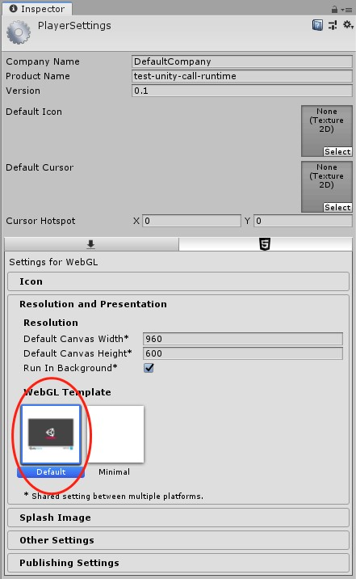
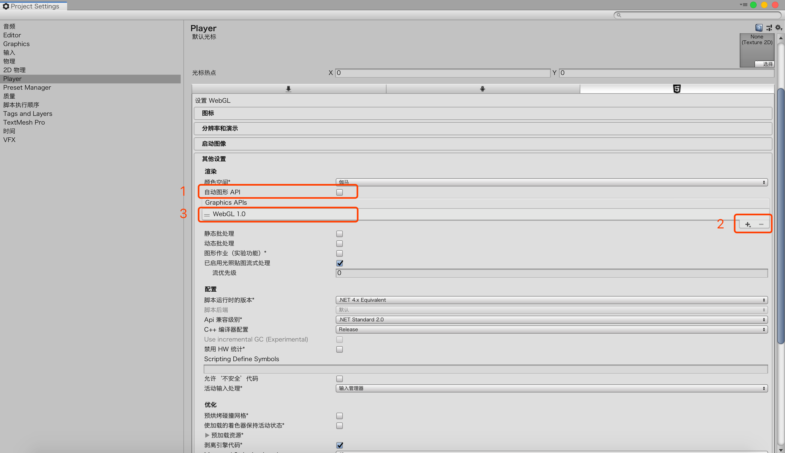
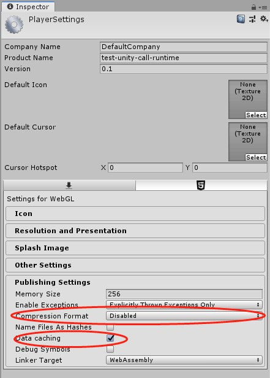

# 打包WebGL并发布到oppo小游戏平台
-   [前提](#section2023_0506_002_001)
-   [安装和配置](#section2023_0506_002_002)
-   [如何使用](#section2023_0506_002_003)
-   [发布](#section2023_0506_002_004)

# 1. 前提<a name="section2023_0506_002_001"></a>

* 安装了node环境，建议安装14.x以上稳定版本 [node官⽹网：https://nodejs.org/en/]


* 游戏包体 rpk 限制在 <color style = 'color:red'>30M </color>以内，并且unity游戏不支持小游戏分包能力。用户本地文件大小限制在 <color style = 'color:red'> 500M </color>以内

* 当前支持版本如下：

    | unity版本     | 推荐版本          |
    | :------      | :-----           | 
    | 2018.4       | 2018.4.30f1      | 
    | 2019.4       | 2019.4.35f1      | 
    | 2020.3       | 2021.3.47f1      | 
    | 2019.3       | 2021.3.14f1      |

# 2. 安装和配置<a name="section2023_0506_002_002"></a>

## 2.1 安装打包工具

1. 安装 OPPO 小游戏打包工具 [@oppo-minigame/cli](https://www.npmjs.com/package/@oppo-minigame/cli)

```
npm i -g @oppo-minigame/cli@2.1.6-beta.10
```

2. 运行 `quickgame -V` 能够正确显示版本号表示安装成功

<color style = 'color:red'>注：若提示 quickgame 不是内部或外部命令，可重新打开命令提示符窗口或者重启计算机后再运行 quickgame -V</color>

> Unity ⽀持的打包工具是 2.1.6-beta.10 版本

## 2.2 安装调试器

1. 当前unity适配能力在内测阶段，所以安装压缩包中的 v_6.8.0_beta.apk 包到 OPPO 手机上才能力进行调试

2. 如果安装成功，手机桌面有一个“快应用”图标出现

# 3. 如何使用<a name="section2023_0506_002_003"></a>

## 3.1 打包 Unity 引擎开发的游戏

 1. 将游戏的 Unity 引擎版本升级到指定的版本.

    > 需要根据错误信息，解决相关问题，并在 Web 版本上运⾏正常，没有相应的报错，才可以转成 OPPO 小游戏

 2. 进行“玩家设置（Player Settings）”
    - Resolution and Presentation -> WebGL Template 设置为“Default”，如下所示：
    

    - 由于当前 OPPO 小游戏只支持标准的 WebGL1.0 的 API ,故需要取消勾选“自动图形 API ”选项，并剔除“ WebGL 2.0”选项，只保留“WebGL 1.0”选项，如下图所示：
    

    - 由于当前 OPPO 小游戏打包 rpk 时，已经做了 GZIP 的压缩，故需要选择非 GZIP 的选项，并勾选“Data caching”。如下图所示：
    

 3. 完成后，在 WebGL 发布的目标目录上，执行

```
    quickgame unity --unityVer 20XX.X.XXf1
```
<color style = 'color:red'>注：--unityVer 参数是当前游戏的unity游戏引擎版本 </color>
<color style = 'color:red'>例如unity版本为2021.3.14f1，那么命令即为: quickgame unity --unityVer 2021.3.14f1</color>

 默认会在 WebGL 发布的目标目录生成quickgame文件夹同级目录;
目录结构如下，dist目录内的rpk包即为可调试包

```javascript
|-quickgame
    |-dist                              //最终的rpk包
        |-com.demo.rpk                  //rpk包
    |-Build                             //Unity 引擎发布的 wasm 文件
        |-demo.xxx                      //Unity 配置文件,各个unity版本会有所不同
        |-demo.xxxxx                    //Unity 资源文件,各个unity版本会有所不同
        |-demo.xxxxx.code               //Unity 代码文件,各个unity版本会有所不同
        |-demo.xxxxx.js               
    |-sign                              //签名
        |-debug                         //测试证书，默认生成
            |-certificate.pem           //证书
            |-private.pem               //私钥
        |-release                       //正式证书，开发者自己添加
            |-certificate.pem           //证书
            |-private.pem               //私钥
    |-game.js               //Unity 适配文件
    |-main.js                           //项目入口文件
    |-xxxxxxxx                          //桌面图标（正方形），开发者自己替换
    |-manifest.json                     //可以配置包名、版本号、授权、图标位置、横竖屏等
```
## 3.2 配置修改与游戏调试

1. 包名、游戏名称、图标等配置修改可直接修改quickgame目录下的manifest.json文件，每次修改后，需要重新打包。
```javascript
{
 // 游戏包名
"package": "com.quickgame.demo",
// 游戏名
"name": "QuickgameDemo",
// 游戏版本
"versionName": "1.0.0",
// 游戏版本
"versionCode": "1",
// 平台版本号，unity版本必须要不低于1103
"minPlatformVersion": "1103",
// 桌面图标，正方形，默认是 108x108 尺寸，注意替换成自己游戏的 icon
"icon": "/logo.png",
// 设备方向，包含 landscape (横屏)和 portrait (竖屏)
"orientation": "portrait",
// 不填或者默认值为 app，取值为 app 或 game
"type":"game",
// logLevel取值 off,error,warn,info,log,debug,trace
"config":{
"logLevel":"off"
}
}

```
修改完成后，该目录下，运行命令生成oppo小游戏的 rpk 包

```
    # 打包用于测试的 rpk
    quickgame pack
    # 打包 release 签名的 rpk
    quickgame pack release
```
2. 游戏调试
- 手机上 sdcard 上新建目录 games/，若目录已存在，忽略这一步
- 将准备好的 rpk 拷贝到手机 sdcard 的 games/ 中
- 打开快应用=》小游戏 tab即可看到待调试游戏

# 4. 发布<a name="section2023_0506_002_004"></a>

开发完成后，我们发布前，需要使用正式的签名和文件来签名

## 4.1 增加 release 签名

 1. 正式签名可参考官方[技术文档](https://ie-activity-cn.heytapimage.com/static/minigame/CN/docs/index.html#/develop/games/quickgame)

## 4.2 发包正式签名的 rpk 包

需要在quickgame目录下使用 “quickgame pack release” 打包生成 rpk，才可以上架到线上。其中开发者需要保留签名，用于以后代码更新重新打包。
