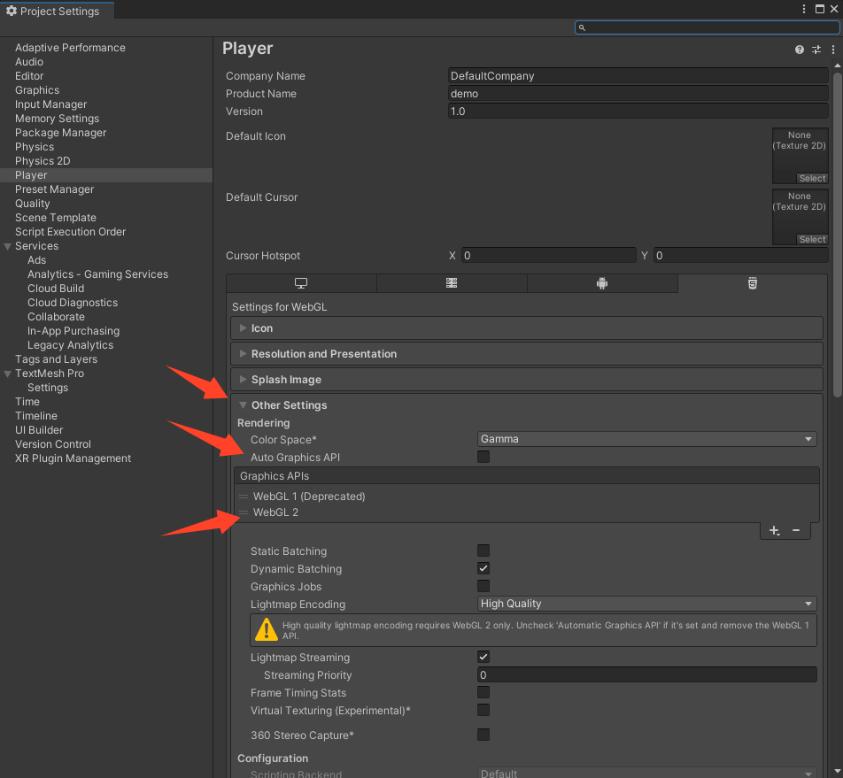
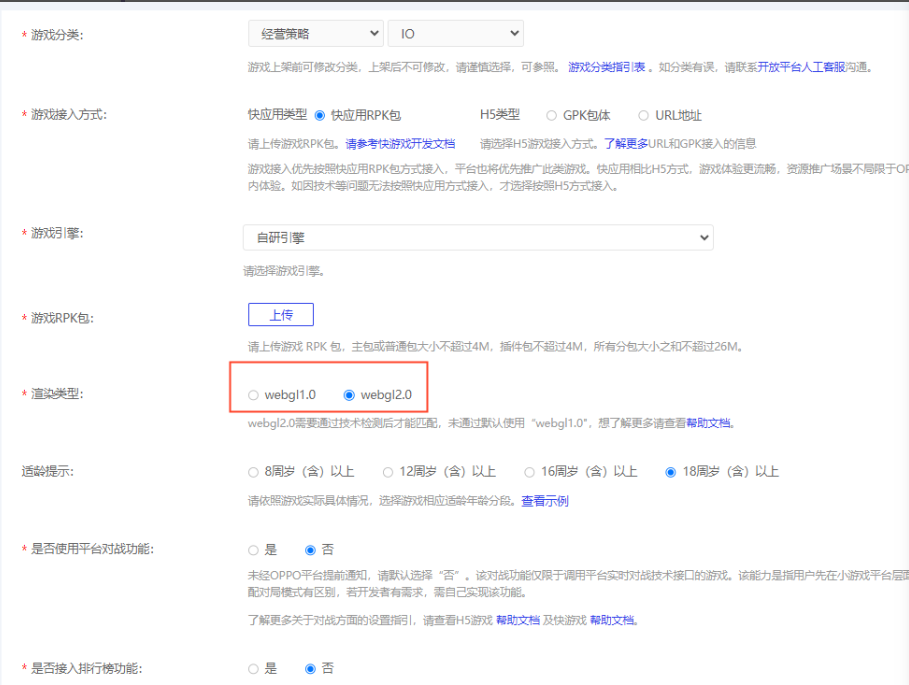

# 使用 WebGL 2.0

## 版本要求

SDK：V8.0.6 及以上
> 推荐通过 [SDK 自检更新](SDKUpdate.md) 能力进行升级。也可前往`tools` 目录安装 `unity_webgl_rpk_oppo_v8.0.6.unitypackage` 及以上版本

小游戏打包工具：2.1.9-beta.6 及以上
> 推荐通过 [SDK 自检更新](SDKUpdate.md) 能力进行升级。也可通过cmd安装命令 npm install @oppo-minigame/cli@beta -g。

## 功能说明

> 界面截图以 `Unity 2021.3.14f1` 版本为例

## 构建设置Webgl2

1. 设置 `Player Settings -> Other Settings -> Auto Graphics API(取消勾选) -> Graphics APIs 右下点击 + 新增WebGL 2`

   

2. 检查版本 `OPPO小游戏 -> 打包小游戏 -> 右下角SDK 版本(8.0.6及以上) -> 小游戏打包工具版本(2.1.9-beta.6及以上)` 

## 测试运行环境

1. 测试运行环境需安装指定版本[调试器](https://ie-activity-cn.heytapimage.com/static/minigame/CN/docs/index.html#/develop/games/wx-transfer?id=%E8%B0%83%E8%AF%95%E5%99%A8) 

2. 不管是WebGL1.0还是WebGL2.0，都建议先在浏览器中运行，查看console相关报错以及渲染情况，无误后再使用OPPO小游戏调试器进行调试

## 发布流程

1.开放平台提交游戏勾选Webgl2.0选项.最终审核结果会同步展示在“游戏审核”界面“渲染类型”字段中
   

## 注意事项

- 如遇到一些特殊的材质或者场景有未适配到渲染相关问题，可以随时联系：oppominigame@oppo.com；QQ：994365657

## 常见QA

### 1、什么样场景适合使用WebGL2.0？

- WebGL 是一种用于在 Web 浏览器中渲染图形的 API，基于 OpenGL ES 图形库的功能。WebGL 1.0 大致与 OpenGL ES 2.0 功能相匹配，而 WebGL 2.0 大致与 OpenGL ES 3.0 功能相匹配。 根据游戏项目统计，我们发现相对于WebGL1，更适合以下游戏需求:
- 线性颜色空间渲染
- 使用GPU Instancing提高渲染性能
- 使用SRP Batcher提高渲染性能
- 使用URP PostProcessing效果提升品质
- 存在大量依赖OpenGL ES 3.0以上的Shader难以降低

### 2、符合什么条件游戏才能在OPPO小游戏平台通过审核？

- 目前只有通过WebGL2.0申请使用的游戏，才能使用平台WebGL2.0渲染能力。在符合平台规定以外，还需要具备以下条件才能通过审核：
- 必须使用WebGL2.0渲染，才能成功渲染的游戏（如果使用WebGL1.0能渲染成功，优先使用WebGL1.0）；
- 使用WebGL2.0渲染，不存在渲染缺陷；
- 在开放平台提交了WebGL2.0审核申请。

### 3、在平台提交了WebGL2.0审核，为什么最终使用WebGL1.0来渲染？

- 平台目前对于申请使用WebGL2.0实行严控策略，只有存在必须使用WebGL2.0才能正常渲染的情况下，才允许使用WebGL2.0。
- 对于提交WebGL2.0申请，但是审核过程中发现使用WebGL1.0就能渲染成功的游戏，自动适配选择WebGL1.0。

### 4、开放平台提交游戏信息审核的环节的渲染类型选项是用来做什么的？

- 开发者可以通过webgl2.0的适用场景进行初步判断,在提交游戏审核环节选择游戏适用的渲染类型，提交到平台后，平台会进一步进行适配测试，从而帮助开发者选择当前更适用于游戏渲染的类型。

### 5、提交WebGL2.0审核后，游戏CP在哪里可以获取最终的审核结果？

- 最终审核结果会同步展示在“游戏审核”界面“渲染类型”字段中