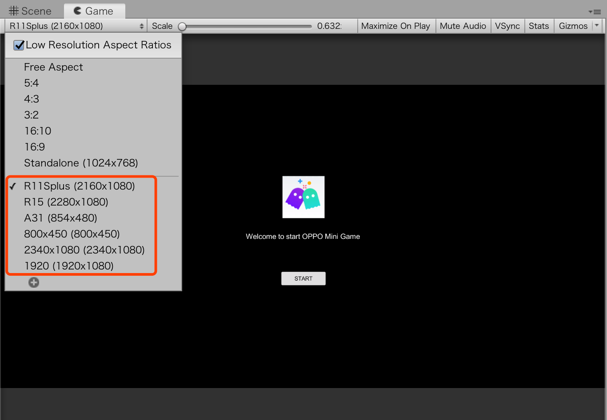

# 常见问题及解决思路
-   [上架未带 xxx.signed.rpk 的 rpk 包到线上?](#section2023_0506_003_001)
-   [游戏有屏幕适配的问题，如：上下左右留有⿊黑边?](#section2023_0506_003_002)
-   [游戏如何修改桌面图标、横竖屏、最小平台版本?](#section2023_0506_003_003)
-   [游戏上架包体太大怎么解决?](#section2023_0506_003_004)
-   [游戏如何接入我们平台的能力，包括：退出、账户、支付、广告等?](#section2023_0506_003_005)
-   [游戏接入平台能力，怎么通过 JavaScript 回调给 C# 脚本?](#section2023_0506_003_006)
-   [默认文字不显示?](#section2023_0506_003_007)
-   [打ab包发布到webgl无法使用?](#section2023_0506_003_008)
-   [音频使用什么格式?](#section2023_0506_003_009)
-   [是否可以使用Blob格式数据?](#section2023_0506_003_010)
-   [安装nodejs时提示Warning: Setting the NODE_TLS_REJECT_UNAUTHORIZED environment variable to ‘0‘ makes TLS connections](#section2023_0506_003_011)
-   [使用demo示例中的支付代码可能会碰到的问题？](#section2023_0506_003_012)
-   [导入"tools/*.unitypackage"可能会碰到的问题？](#section2024_0116_001_001)

### 上架未带 xxx.signed.rpk 的 rpk 包到线上？<a name="section2023_0506_003_001"></a>


```
答：需要使用 “quickgame unity release” 打包生成 rpk，才可以上架到线上。其
中开发者需要保留签名，用于以后代码更新重新打包。
```
### 游戏有屏幕适配的问题，如：上下左右留有⿊黑边？<a name="section2023_0506_003_002"></a>
```
答：开发者需要针对不同的手机进行屏幕适配。由于 OPPO 小游戏的画布宽和高跟屏幕分
辩率保持一致，并且 devicePixelRatio 为 1 ，所以进行适配，首先需要适配不同的手机
分辨率，如下所示：
```


```
最后需要适配发布的分辨率，并在手机进行测试，如下所示：
```


### 游戏如何修改桌面图标、横竖屏、最小平台版本？<a name="section2023_0506_003_003"></a>

```
答： 只要修改 quickgame/manifest.json 文件，并且重新用 quickgame unity [release] 即可重新发布。
```
### 游戏上架包体太大怎么解决？<a name="section2023_0506_003_004"></a>

```
答： 由于 OPPO 小游戏平台对 rpk 包体有限制大小，最大不能超过 30 M。而 Unity 发布的游戏大部分都比较大，
```
```
1、将游戏的资源放到开发者自己的服务器上，并修改 Unity 配置文件，再重新打包。以2019版本为例如下所示:
```
```javascript
{
  "companyName": "company",
  "productName": "demo",
  "productVersion": "0.1",
  "dataUrl": "https://xxx.com/webgl.data.unityweb",
  "wasmCodeUrl": "https://xxx.com/webgl.wasm.code.unityweb",
  "wasmFrameworkUrl": "webgl.wasm.framework.unityweb",
  "graphicsAPI": ["WebGL 1.0"],
  "webglContextAttributes": {"preserveDrawingBuffer": false},
  "splashScreenStyle": "Dark",
  "backgroundColor": "#231F20",
  "developmentBuild": false,
  "multithreading": false,
  "unityVersion": "2019.1.0f2"
}
```
```
2、对Unity游戏进行分包处理。将Unity游戏项目发布成WebGL项目。
原Unity项目中AssetBundle文件保存WebGL项目的StreamingAssets文件夹下。
把StreamingAssets文件夹中的所有内容放到自己服务器上。
打包RPK包时，在WebGL 发布的目标目录执行命令时，添加参数--addressable ，参数value是为您的服务器地址。
命令示例如下：
quickgame unity --unityVer 2021.3.14f1 --addressable https://oppo/AddressableAssetsData 
打包后的RPK包体缩小不少，成功把分包中的资源放到远程服务器上请求了。
经过上述处理后，打包的RPK包体仍然超出规定的30MB，后续还可以考虑压缩、优化、重构源代码。
```
### 游戏如何接入我们平台的能力，包括：退出、账户、支付、广告等？<a name="section2023_0506_003_005"></a>

```
答：可以通过调用 window 能力一样调用我们平台能力，
具体参考 Unity 开发文档：
https://docs.unity3d.com/Manual/webgl-interactingwithbrowserscripting.html 
OPPO 小游戏 API 文档：
https://ie-activity-cn.heytapimage.com/static/minigame/CN/docs/index.html#/
```
### 游戏接入平台能力，怎么通过 JavaScript 回调给 C# 脚本？<a name="section2023_0506_003_006"></a>

```
答：可以通过 window.unityInstance.SendMessage(objectName,
methodName, value); 进行调用，其中 OPPO 会将初始化的 Unity 实例赋值到
window['unityInstance'] 中，具体参考 Unity 开发⽂文档：
https://docs.unity3d.com/Manual/webgl-
interactingwithbrowserscripting.html 。OPPO 小游戏 API 文档：
https://cdofs.oppomobile.com/cdo-
activity/static/201810/ 26 /quickgame/documentation/
```
### 默认文字不显示？<a name="section2023_0506_003_007"></a>
```
答：默认中文字体不显示，必须使用外部导入的字体（需要下载字体文件）。
```

### 打ab包发布到webgl无法使用？<a name="section2023_0506_003_008"></a>
```c#
 答：打ab包发布到webgl无法使用，需要使用LZ4压缩AssetBundle。
 BuildPipeline.BuildAssetBundles(path, BuildAssetBundleOptions.ChunkBasedCompression, BuildTarget.WebGL);
```

### 音频使用什么格式？<a name="section2023_0506_003_009"></a>
```
答：mp3格式。
```

### 是否可以使用Blob格式数据？<a name="section2023_0506_003_010"></a>
```
答：当前不支持，需要用其他格式进行替代。
```

### 安装nodejs时提示Warning: Setting the NODE_TLS_REJECT_UNAUTHORIZED environment variable to ‘0‘ makes TLS connections<a name="section2023_0506_003_011"></a>
```
答：环境变量里面查看，如果配置了NODE_TLS_REJECT_UNAUTHORIZED，将其删除就可以了
```

### 使用demo示例中的支付代码可能会碰到的问题？<a name="section2023_0506_003_012"></a>
```
答：
  1、调用using LitJson报错时，需要下载[LitJSON](https://github.com/LitJSON)https://github.com/litjson/litjson，如何使用请参考https://blog.csdn.net/qq_50563459/article/details/130295808。

  2、调用using Newtonsoft.Json报错时，该功能为把对象转换成json字符串或者反转，需要导入否则会报错，这是因为  Json.NET 官方没有直接支持 Unity ，导致 Unity 无法找到正确的程序集。可参考https://www.yii666.com/blog/335233.html。
```

### 导入"tools/*.unitypackage"可能会碰到的问题？<a name="section2024_0116_001_001"></a>
```
答：
1、导入2021版本编辑器时报错"Multiple precompiled assemblies with the same name Newtonsoft.Json.dll..."，由于2021版本已集成Newtonsoft，直接删除所在文件夹即可
```

# 7. 其他
### C#与js交互

（1）需要传入回调函数的处理方式

- 创建cs代码
```c#
using System;
using System.Collections;
using System.Collections.Generic;
using System.Runtime.InteropServices;
using AOT;
using UnityEngine;
public class QuickGameManager : MonoBehaviour {
    [DllImport ("__Internal")]
    //方法名与参数返回值要与jslib里的方法名一模一样
    public static extern void LoginCallback (Action<string> action);

    public void LoginGame()
    {
      //传入回调函数
      LoginCallback(LoginSuccess);
    }
  
    //需要加MonoPInvokeCallback 标记
    [MonoPInvokeCallback(typeof(Action<string>))]
    public static void LoginSuccess(string arg)
    {
      //输出回调函数携带的数据
      Debug.Log(arg.ToString());
    }
}
```
- 创建js代码（js代码要写在后缀为jslib的文件中）
```javascript
    mergeInto(LibraryManager.library, {
        //这里会传入上述cs代码中的LoginSuccess函数
        LoginCallback: function (callback) {
            qg.login({
                success: function(res){ 
                    var data = JSON.stringify(res.data);//玩家信息
                    var bufferSize = lengthBytesUTF8(data) + 1;
                    var buffer = _malloc(bufferSize);
                    stringToUTF8(data, buffer, bufferSize);
                    /**
                    //没有参数是
                    Runtime.dynCall('v', JsCallCsTest.callback);
                    // 一个参数是
                    Runtime.dynCall('vi', JsCallCsTest.callback, [param1]);
                    //两个参数是
                    Runtime.dynCall('vii', JsCallCsTest.callback, [param1, param2]);
                    //三个参数是
                    Runtime.dynCall('viii', JsCallCsTest.callback, [param1, param2, param3]);
                    //四个参数是
                    Runtime.dynCall('viiii', JsCallCsTest.callback, [param1, param2, param3, param4]);
                    */
                    Runtime.dynCall('vi', callback, [buffer]);
            },
            fail: function(res) {
                console.log("登录失败:",JSON.stringify(res))
            }
        });
        }
    });
```
参考地址[c#与js交互](https://forum.unity.com/threads/webgl-throwing-abort-104-on-callback-from-jslib-function.534720/);

3、调用登录
```c#
QuickGameManager.GetInstance().LoginGame();//请求登录
```

（2）需要传入参数的处理方式

- c#代码
```c#
    [DllImport("__Internal")]
    private static extern void localStorageSetItem(string keyName, string keyValue);
    public void SetItem(string keyName, string keyValue)
    {
        localStorageSetItem(keyName, keyValue);
    }
```
- js代码
```javascript
    localStorageSetItem:function(keyName,keyValue){
        //c#向js传参数必须要使用Pointer_stringify转换一下，保证传参不变
        var name = Pointer_stringify(keyName);
        var value = Pointer_stringify(keyValue);
        localStorage.setItem(name,value);
    }
```


# 接入平台接口能力
oppo小游戏接口[可参考oppo小游戏官方技术文档](hhttps://ie-activity-cn.heytapimage.com/static/minigame/CN/docs/index.html#/)