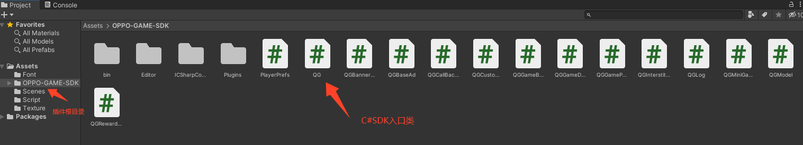

# OPPO小游戏C#SDK接口使用说明

## 1. 注册并下载插件

在[OPPO开发者平台](https://open.oppomobile.com/new/introduction?page_name=h5game)注册并创建您的小游戏应用后，您需要下载oppo小游戏unity插件。

## 2. 使用SDK接口

OPPO小游戏C# SDK，它提供了许多与OPPO小游戏相关的功能和接口，

在您的C#脚本中，您可以使用OPPO小游戏C# SDK提供的接口来实现包括登录、支付、各类广告、数据存储读取删除等能力。使用此插件可以帮助您更快地开发OPPO小游戏，并且提高游戏的用户体验。以下是一些常用的接口：

### 2.1 登录接口

使用此接口可以让玩家使用OPPO账号登录游戏。以下是示例代码：

```c#
QG.Login(
    (msg) => { Debug.Log("QG.Login success = " + JsonUtility.ToJson(msg)); },
    (msg) => { Debug.Log("QG.Login fail = " + msg.errMsg); }
);
```

### 2.2 支付接口

使用此接口可以让玩家在游戏中购买虚拟物品道具。以下是示例代码：

```c#
PayParam param = new PayParam()
        {
            appId = "123", 
            token = "xxxxxxxxxxxxxxxxxxxx",
            timestamp = 1682244531643,  
            orderNo = "1",
            paySign = "xxxxxxxxxxxxxxxxxxxx",
            // paySign 由 CP 服务端使用 appKey (不是 appId )、orderNo、timestamp 进行签名算法生成返回
        };
        QG.Pay(
            param,
            (msg) => { Debug.Log("QG.Pay success = " + JsonUtility.ToJson(msg)); },
            (msg) => { Debug.Log("QG.Pay fail = " + JsonUtility.ToJson(msg)); },
            (msg) => { Debug.Log("QG.Pay complete = " + JsonUtility.ToJson(msg)); }
        );
```

### 2.3 激励视频广告接口

使用此接口可以让玩家在游戏中打开激励视频广告。以下是示例代码：

```c#
var rewardedVideoAd = QG.CreateRewardedVideoAd(new QGCommonAdParam()
          {
          adUnitId = "114183"
          });
          Debug.Log("创建激励视频开始运行");
          rewardedVideoAd.OnLoad(() => {
            Debug.Log("激励视频广告加载成功");
          rewardedVideoAd.Show();
          });
          rewardedVideoAd.OnError((QGBaseResponse msg) =>
          {
          Debug.Log("QG.rewardedVideoAd.OnError success = " + JsonUtility.ToJson(msg));
          });
          rewardedVideoAd.OnClose((QGRewardedVideoResponse msg) =>
          {
          if (msg.isEnded) {
                Debug.Log("激励视频广告完成，发放奖励");
              } else {
                Debug.Log("激励视频广告取消关闭，不发放奖励");
              }
         });
```

## 3. 自定义拓展

可参考Unity提供的C#调用JS方法的代码示例 https://docs.unity.cn/cn/2019.4/Manual/webgl-interactingwithbrowserscripting.html

主要在Plugins中的（qg.minigame.jslib）插件编写JS代码及在QGMiniGameManager封装调用入口，可依据[OPPO小游戏文档](https://ie-activity-cn.heytapimage.com/static/minigame/CN/docs/index.html#/develop/feature/account)自行添加能力

以登录功能举例：

（1）先在qg.minigame.jslib文件中写入oppo小游戏登录API（qg.login）

```js
QGLogin: function (success, fail) {
    if (typeof qg == "undefined") {
      console.log("qg.minigame.jslib  qg is undefined");
      return;
    }

    var successID = UTF8ToString(success);
    var failID = UTF8ToString(fail);

    qg.login({
      success: function (res) {
        var json = JSON.stringify({
          callbackId: successID,
          data: res.data,
        });
        unityInstance.SendMessage(
          CONSTANT.ACTION_CALL_BACK_CLASS_NAME_DEFAULT,
          "LoginResponseCallback",
          json
        );
      },
      fail: function (res) {
        var json = JSON.stringify({
          callbackId: failID,
          errMsg: res.errMsg,
          errCode: res.errCode,
        });
        unityInstance.SendMessage(
          CONSTANT.ACTION_CALL_BACK_CLASS_NAME_DEFAULT,
          "LoginResponseCallback",
          json
        );
      },
    });
  },
```

（2）在QGMiniGameManager.cs中注册

~~~c#
#region 登录

        public void Login(Action<QGCommonResponse<QGLoginBean>> successCallback = null, Action<QGCommonResponse<QGLoginBean>> failCallback = null)
        {
            QGLogin(QGCallBackManager.Add(successCallback), QGCallBackManager.Add(failCallback));
        }

        #endregion
~~~

（3）在QGModel.cs写入API中的实体类（请求参和返回参）

~~~c#
[Serializable]
    public class QGLoginBean
    {   
        public string avatar;
        public string sex;
        public string age;
        public string token; //调用接口获取登录凭证（token）。通过凭证进而换取用户登录态信息，包括用户的唯一标识（openid）
        public string nickName;
        public string uid;
        public string time;
        public string code;
        public string phoneNum;
    }
~~~


（4）在QG.cs文件中写入调用

~~~js
#region Login  登录
        // https://ie-activity-cn.heytapimage.com/static/minigame/CN/docs/index.html#/develop/feature/account
        //QG.Login(
        //(msg) => { Debug.Log("QG.Login success = " + JsonUtility.ToJson(msg)); },
        //(msg) => { Debug.Log("QG.Login fail = " + msg.errMsg); }
        ///);
        public static void Login(Action<QGCommonResponse<QGLoginBean>> successCallback = null, Action<QGCommonResponse<QGLoginBean>> failCallback = null)
        {
            QGMiniGameManager.Instance.Login(successCallback, failCallback);
        }
        #endregion
~~~

（5）如何调用API能力

新建一个c#文件,引入using QGMiniGame;

~~~c#
 // 1、登录
        QG
            .Login((msg) =>
            {
                Debug.Log("QG.Login success = " + JsonUtility.ToJson(msg));
            },
            (msg) =>
            {
                Debug.Log("QG.Login fail = " + msg.errMsg);
            });
~~~


## 4. 插件目录详细介绍



~~~
OPPO-GAME-SDK/                                          SDK源码文件夹
├── Plugins/
│   ├── qg.minigame.jslib                               JS插件，用于处理C#调用的方法以及callBack通讯
├── QG.cs                                               调用代码入口
├── QGModel.cs                                          API中的实体类（请求参和返回参）
├── QGMiniGameManager.cs                                C#与JS通讯的桥接代码
├── QGCallBackManager.cs                                用于处理JS相关的回调，JS对象映射到C#对象
└── CHANGELOG                                           版本日志查看
~~~

