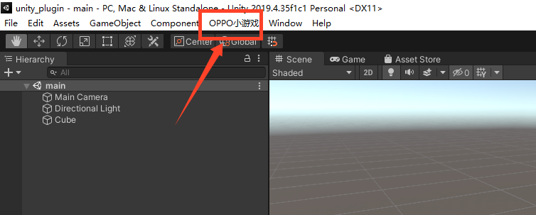
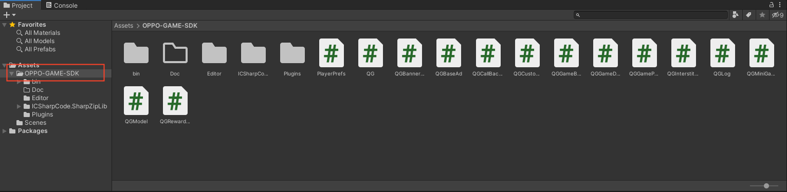
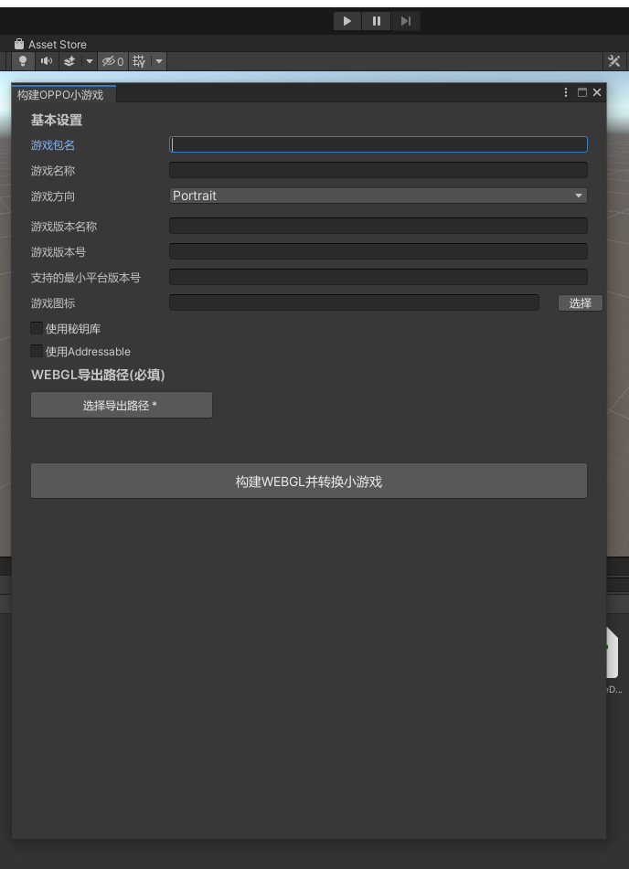
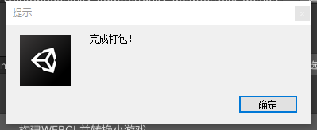

# 第二步：发布WebGL项目

## 插件介绍
- 将下载的插件导入游戏项目内，如下图显示。
  
- 导入成功后，插件内容如下图所示：
  

- 插件文件目录介绍

1. Editor文件夹为构建webgl并转换成rpk工程。
2. Plugins文件夹为C#调用JS平台能力的代码。

## 插件使用
插件如下图所示，开发者可根据描述自行填入对应的内容。
  

填写完成后直接点击【构建WEBGL并转换小游戏】按钮即可，待转换完成后会提示开发者rpk打包完成，点击确定按钮可直接打开rpk所在的文件夹。
  